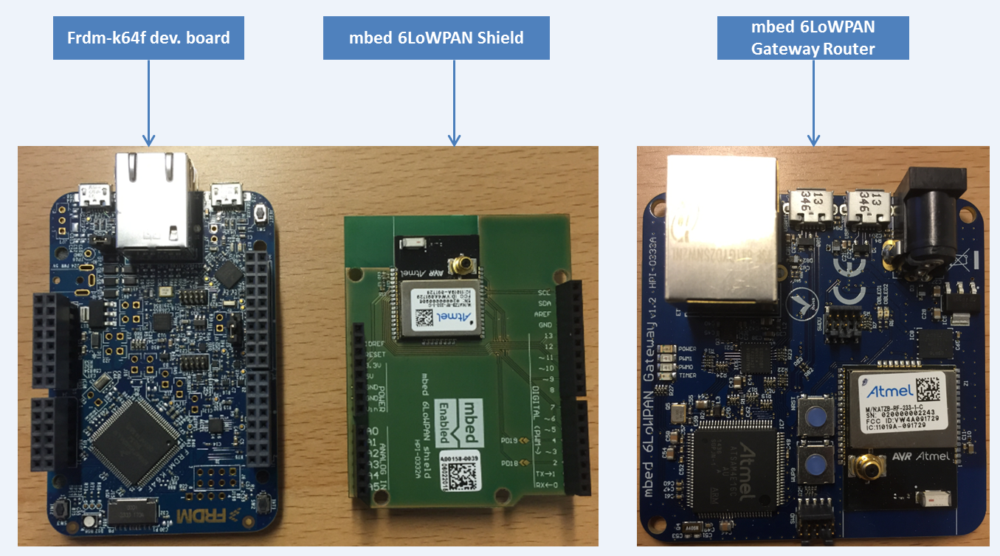
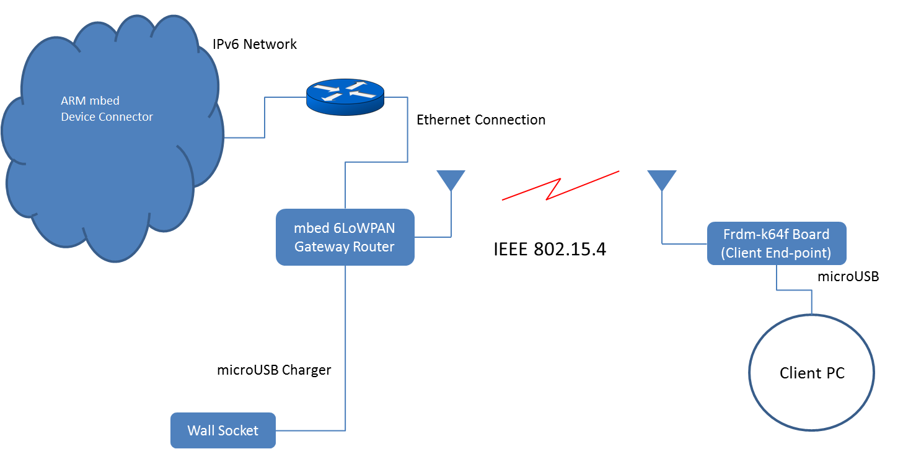
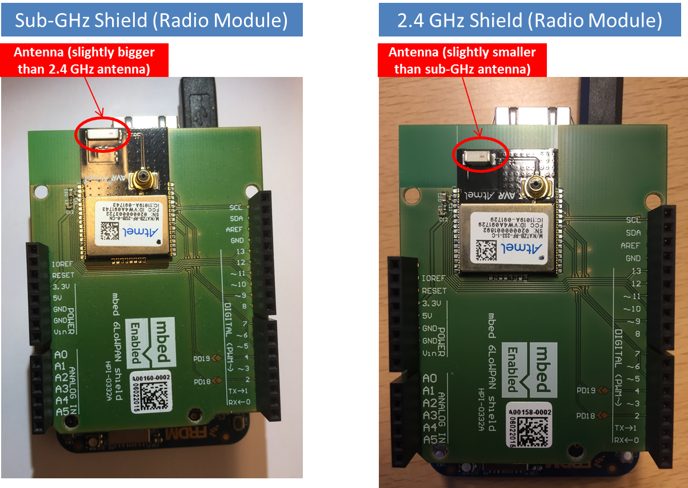
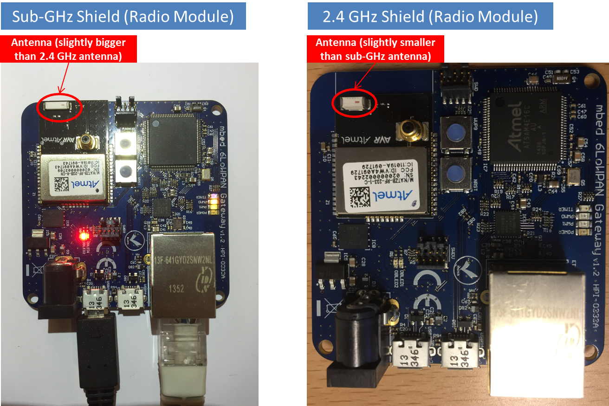

# Getting started with mesh networking

This document describes how to use mesh networking to communicate with a [ARM mbed Device Connector](https://connector.mbed.com) 
that is a new web service hosted by ARM.

This example application demonstrates how to:

* Connect a client to a **6LoWPAN ND** or **Thread** type of mesh network.
* Register, read resource values and send observations to ARM mbed Device Connector.
* Deregister from ARM mbed Device Connector.
* Disconnect the client from the mesh network.

**Note**: This application does not work with the mbed Device Server. If you want to use mbed DS, please check the example and instructions [here](https://github.com/ARMmbed/mbed-client-example-6lowpan/tree/device_server).

## Switching to Thread

By default, the example application makes a **6LoWPAN ND** type of bootstrap. To change the bootstrap mode to **Thread**
you need to define (uncomment) the macro `APPL_BOOTSTRAP_MODE_THREAD` in the file `source/main.cpp`. 

## Required hardware

* An FRDM-K64F development board (client end-point).
* An mbed 6LoWPAN shield (with a radio module).
* An mbed 6LoWPAN Gateway router.
* A micro-USB cable.
* A micro-USB charger for powering the mbed 6LoWPAN Gateway router.
* An Ethernet cable.




## Required software

* [yotta](http://docs.yottabuild.org/#installing) - to build the example programs.
* [ARM mbed Device Connector website](https://connector.mbed.com) - Web service running on Internet.


## Optional software
* [Wireshark](https://www.wireshark.org/) - for packet inspection and network debugging.
* [PuTTY](http://www.chiark.greenend.org.uk/~sgtatham/putty/download.html) - for serial terminal emulation.


## Reference block diagram

- **Setup block diagram**
 

* Connect the Gateway router with an Ethernet cable to a router/L3 switch. 

* To power up the Gateway router, use a micro-USB charger connected to a wall socket or a micro-USB cable connected to a computer.

* To flash the Gateway router with the firmware, you need a micro-USB cable (see gateway flashing instructions below).

* The wireless link between the FRDM-K64F board (client end-point) and the Gateway router follows the IEEE 802.15.4 standard.

* To power up the FRDM-K64F board (client end-point), use either a micro-USB charger or a micro-USB cable. If you are using micro-USB, you can view the debug and trace messages using third party software like PuTTY.

**Note!**

* If you are using a virtual machine, please set your network adapter mode to **Bridged**.


##Setting up the environment

To set up the environment, you need to configure the mbed 6LoWPAN Gateway router and the client as follows:
  
### Gateway configuration

1. Use an Ethernet cable to connect the mbed 6LoWPAN Gateway router to the Internet.

2. Use a micro-USB cable to connect the mbed 6LoWPAN Gateway router to your computer. The computer will list the router as removable storage.

3. The firmware for the Gateway is located in the `GW_Binary` folder in the root of this example. You should select the binary matching your application bootstrap mode:

	* For **6LoWPAN ND** bootstrap, use `gateway6LoWPANDynamic.bin`.
	* For **Thread** bootstrap, use `gatewayThreadDynamic.bin`.

4. Copy the gateway binary file to the mbed 6LoWPAN Gateway router to flash the device. The device will reboot automatically after flashing. If that does not happen, push the **Reset** button on the board.

### Client side configuration

For client side configuration, please follow the steps below.

1. Set the application certificate as described in [Setting Certificate for the application](#setting-certificate-for-the-application) section.
2. Configure the `mbed-client-example-6lowpan` application to use the IPv6 address of the ARM mbed Device Connector:
	* The `/source/mbedclient.cpp` file contains the IPv6 address of the ARM mbed Device Connector. By default, this is set to `2607:f0d0:3701:9f::20`. It can be found on line 35, as the value of `MBED_DEVICE_CONNECTOR_URI`. The full address format is `coap://<IPv6 address>:PORT`, that is `coap://2607:f0d0:3701:9f::20:5684`. 
3. Configure the `mbed-client-example-6lowpan` application to use an appropriate radio channel based on your hardware. See [Changing radio channel](#changing-radio-channel) section for instructions.
4. Build `mbed-client-example-6lowpan` (see [Build instructions](#build-instructions)).
5. Load the `mbed-client-example-6lowpan` application binary to the FRDM-K64F board (see [Running the example application](#running-the-example-application)).

**Note:** You may need to open UDP port 5684 in your computer's firewall for the ARM mbed Device Connector to communicate with this example application.


### IP address setup

This example uses IPv6 to communicate with the [mbed Device Connector Server](https://api.connector.mbed.com). The example program should automatically get an IPv6 address from the mbed 6LoWPAN Gateway router when it is connected via Ethernet.


#### Setting Certificate for the application

1. Go to  [mbed Device Connector website](https://connector.mbed.com) and log in with your mbed.org account.
2. Navigate to **Security credentials** under **My devices**.
3. Click **GET MY DEVICE SECURITY CREDENTIALS**. You will get the needed certificate information as well as the endpoint name and domain.
4. Copy the created security credentials to file `source/security.h`.

#### Changing radio channel

To change the radio channel you are using:

* Clone the `mbed-mesh-api` repository to your work area:

```
git clone git@github.com:ARMmbed/mbed-mesh-api.git
```

* Modify the source code:

	- In your copy of the `mbed-mesh-api` repository, find the file `./source/include/static_config.h`.

	- You need to use channel **1** for a sub-GHz module and channel **12** for a 2.4 GHz module.

		**Tip:** To identify which radio module you have, see the section [Radio Module Identification](#radio-module-identification).

		- For **6LoWPAN-ND**, change the macro `SCAN_CHANNEL_LIST` to either **1** (1<<1) or **12** (1<<12).

		- For **Thread**, change the macro `THREAD_RF_CHANNEL` to either **1** or **12**.
	
* Create a yotta link to your code:

	```
	cd mbed-mesh-api
	yt link
	```
* Go back to the `mbed-client-example-6lowpan` application folder and make a link to the cloned `mbed-mesh-api` repository:

	```
	cd mbed-client-example-6lowpan
	yt link mbed-mesh-api
	```

* Use the command `yt ls` to check that the link was established successfully and the module `mbed-mesh-api` points to the cloned repository.

##### Radio module identification

* Make sure that you are using the same radio modules on both server and client sides:

	* If the radio module on the Gateway router supports the 2.4 GHz frequency band, the client side must have an mbed 6LoWPAN shield that uses a 2.4 GHz radio module (such as Atmel AT86RF233).

	* If the radio module on the Gateway router supports the sub-GHz frequency band, the client side must have an mbed 6LoWPAN shield that uses a sub-GHz radio module (such as Atmel AT86RF212B).

* An easy way to identify which frequency band your setup uses is to check the **Antenna size** on the radio module:

	* The sub-GHz band antenna is larger than the 2.4 GHz antenna.

	* For the client side (mbed 6LoWPAN shield connected to an FRDM-K64F board), see the image below:
   

	* For the Gateway router, see the image below:
   


## Build instructions
		
1. Install yotta. See instructions [here](http://docs.yottabuild.org/#installing). On Linux, enter `pip install --pre pyusb` and then `pip install yotta`.

2. Install the necessary toolchains. See [Required software](#required-software). 

3. Set the `IPv6` address for the ARM mbed Device Connector in `source/lwm2mclient.cpp` if you have not done it yet. The instructions are in the [Client side configuration](#client-side-configuration) section of this document. 

4. In the command line, move to the root of this example application.

5. Set up the target device: `yotta target frdm-k64f-gcc`.

6. Build the binary: `yotta build`.

The executable file will be created in the `/build/frdm-k64f-gcc/source/` folder.

## Running the example application

1. Find the  binary file `mbed-client-example-6lowpan.bin` in the folder `mbed-client-example-6lowpan/build/frdm-k64f-gcc/source/`.

2. Copy the binary to the USB mass storage root of the FRDM-K64F development board. It will be automatically flashed to the target MCU. After flashing, the board will restart itself. Press the **Reset** button of the development board if it does not restart automatically.

3. The program starts up and will begin registration with the ARM mbed Device Connector.

4. After a successful registration, the program will automatically start sending observations every 10 seconds.


## Test usage

### Testing the example application with the mbed Device Connector

**Step 1**: Go to the [mbed Device Connector website](https://connector.mbed.com).

**Step 2**: Log in using your mbed account.

**Step 3**: Click the **Connected devices** link under **My devices** to see your registered devices.

**Step 4**: To send requests to mbed Client device with mbed Device Connector API, click **API Console** under **mbed Device Connector**. Click the URL textbox to create a request. The textbox will show a list of registered resources. After selecting the resource press the **TEST API** button to send the request.

The **/Test/0/S** represents the static resource that is a fixed value set in the example application. For example:
`https://api.connector.mbed.com/endpoints/<ENDPOINT_NAME>/Test/0/S?sync=true`, where `<ENDPOINT_NAME>` is the name of the connected device. It creates a request to the **/Test/0/S** resource.

The **/Test/0/D** represents the dynamic resource that can be read by the mbed Device Connector. It is linked with the **SW2** button on the FRDM board. The value starts from zero and every time you press the **SW2** button the node increases the counter value by 1. You can make a CoAP request to the node resources to get the latest value. To do that, click **API Console** under **mbed Device Connector**. Click the URL textbox to create a request.

For example: `https://api.connector.mbed.com/endpoints/<ENDPOINT_NAME>/Test/0/D?sync=true`, where `<ENDPOINT_NAME>` is the name of the connected device, creates a GET request to the **/Test/0/D** resource. This returns the latest value of **/Test/0/D**. 

**NOTE:** If you get, for example, an error `Server Response:410(Gone)` or other such error, clear the cache of your browser, log out and log in again.

For more information on the mbed Device Connector REST API, see the [help pages](https://connector.mbed.com/#help-rest-api).

**Step 5**: If you press the **SW3** button the endpoint sends a deregister message to the mbed Device Connector. After a successful deregistration, LED **D12** starts blinking indicating that the application has successfully completed the task.


### Debug trace on client side

To see the debug trace for the mbed Client, you can use either Wireshark or terminal emulation software.

The following is an example of using PuTTY and Linux:

1. On the computer, open PuTTY with root privileges: `$ sudo putty`.

2. Give the command `dmesg`to see which serial port your mbed Client controller is connected to.

3. Go to the **Serial** category in PuTTY.

4. Type your identified port in the section **Serial line to connect to**, for example `/dev/ttyACM0`.

5. In the **Configure the serial line** section, enter the following details:

	* Baud-rate = 115200.
	* Data bits = 8.
	* Stop bits = 1.
	* flow control = xon/xoff.

6. Click the **Session** category. Give the session a name, for example `mbed_trace`, and save it.

7. Select **Connection_type** `Serial`.

8. Click **Open**.

This will give you the client's debug trace.

## Troubleshooting

If **lwm2m-client-6lowpan-endpoint** is not visible in the ARM mbed Device Connector try one of the following:

* Clear your browser cache.
* Restart the 6LoWPAN Gateway.
* Restart the FRDM-K64F board.

You can also check the following settings:

* Check that channels are set as described in [Changing radio channel](#changing-radio-channel).
* Check that the mbed 6LoWPAN Gateway is using the correct binary, as explained in [Gateway configuration](#gateway-configuration).
* Check that the ARM mbed Device Connector address is set to `mbed-client-example-6lowpan`, as explained in [Client side configuration](#client-side-configuration).
* Check the client trace. It should indicate that the bootstrap is ready when the FRDM-K64F board is connected to the mbed 6LoWPAN Gateway. 

For example, the **6LoWPAN ND** bootstrap trace window will indicate the bootstrap state and object registration as follows:

```
[INFO][m6LND]: 6LoWPAN ND bootstrap ready
...
[DBG ][m6LND]: Channel: 1
[DBG ][mbedclient]: mesh_network_handler() 0
[DBG ][mbedclient]: waiting 15s before sending registration...
[DBG ][mbedclient]: send_registration()
...
[DBG ][mbedclient]: object_registered()

```

