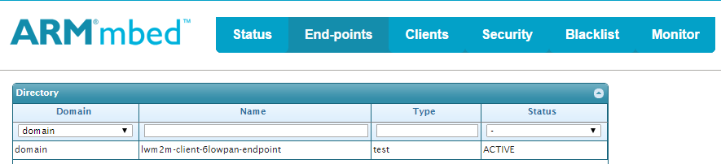

# Getting started with mesh networking

This document describes how to use mesh networking to communicate with mbed Device Server (mDS).

This example application demonstrates how to:

* Connect to a **6LoWPAN ND** or **Thread** type of mesh network.
* Register, read resource values and send observations to mDS and deregister from it.
* Disconnect from the network.

By default, the example application makes a **6LoWPAN ND** bootstrap. To change the bootstrap mode to **Thread**
you need to define (uncomment) a macro `APPL_BOOTSTRAP_MODE_THREAD` in file `source/main.cpp`. 


## Required hardware

* An FRDM-K64F development board (client end-point)
* An mbed 6LoWPAN shield (with radio module)
* An mbed 6LoWPAN Gateway router
* A micro-USB cable
* A micro-USB charger for powering the mbed 6LoWPAN Gateway
* An Ethernet cable
* A computer running the mDS

 


## Required software

* [Yotta](http://docs.yottabuild.org/#installing) - to build the example programs.
* [mbed Device Server (mDS)](https://silver.arm.com/browse/SEN00) - where the example application connects to.

## Optional software
* [Wireshark](https://www.wireshark.org/) - for packet inspection and network debugging.
* [Putty](http://www.chiark.greenend.org.uk/~sgtatham/putty/download.html) - for serial terminal emulation.

## Reference Block Diagram
 

* Connect the Gateway router to the mDS with an Ethernet cable. 
* To power up the Gateway router use a micro-USB charger connected to a wall socket or a micro-USB cable connected to a computer.
* To flash the Gateway router with the firmware, you need a micro-USB cable. (See flashing instructions below)
* The wireless link between the FRDM-K64F board (Client end-point) and the Gateway router is following the IEEE 802.15.4 standard. 
* To power up the FRDM-K64F board (Client end-point) use either a micro-USB charger or a micro-USB cable. If you are using micro-USB, you can view the debug and trace messages utilizing an optional software listed above, for example Putty.


##Test environment setup
### Server side

1. Connect the mbed 6LoWPAN Gateway router to a computer running mDS with an Ethernet cable.
2. Connect the micro-USB cable to the mbed 6LoWPAN Gateway router. It will be shown in your computer as a removable memory.
3. The firmware for the Gateway is located in the `GW_Binary` folder in the root of this example. You should select the right binary based on the application bootstrap mode.

	* with the **6LoWPAN ND** boostrap, use `gateway6LoWPANStatic.bin`
	* with the **Thread** bootstrap, use `gatewayThreadStatic.bin`

4. Copy the gateway binary file to the mbed 6LoWPAN Gateway router to flash the device. The device will reboot automatically after flashing. If it does not happen, push the **Reset** button on the board.
5. Download and run the mDS on your computer (see instructions below).

#### Static configuration

Set your computer to run on IP address `fd00:ff1:ce0b:a5e0::1` and use 64-bit
network mask `fd00:ff1:ce0b:a5e0::1/64`. Make sure that the computer with mDS running is **not** connected to the internet.

**Setting up IP in Windows:**

1. Read first [Microsoft: Changing TCP/IP settings](http://windows.microsoft.com/en-gb/windows/change-tcp-ip-settings).
2. Go to **IPv6 properties**.
3. Select **Use following**.
4. Enter `fd00:ff1:ce0b:a5e0::1`.
5. Enter subnet prefix length: `64`.
6. Click **OK**.

**Note!**  
If you need a separate driver for Windows OS [download](https://developer.mbed.org/handbook/Windows-serial-configuration) the mbed Windows Serial Port driver.

**Setting up IP in Linux:**

```
ifconfig eth0 add fd00:ff1:ce0b:a5e0::1/64
```

#### Dynamic configuration

**Note:** This section applies only if you plan to run the mDS from a network server.

Binaries `gateway6LoWPANDynamic.bin` and `gatewayThreadDynamic.bin` will work when mDS is running on the IPv6 network. You should use the binary that corresponds your application bootstrap mode and flash it according to the instructions above.

You do not need to adjust your computer settings because the mbed 6LoWPAN Gateway will receive the IPv6 address from the network.


### Client side

1. Connect the FRDM-K64F development board to the mbed 6LoWPAN shield.
2. Configure the `mbed-client-example-6lowpan` application to use the IPv6 address of the mDS:
    * On Windows:
         * in the computer running the mDS, open the command prompt and type _ipconfig_
         * section **Ethernet adapter Local Area Connection** field **IPv6 address** contains the IPv6 address
    * On Mac OS X and Linux:
         * in a Mac or a Linux machine running the mDS, open the terminal and type _ifconfig_
         * under the appropriate device (usually `eth0`, `en0`, or something similar), look for the `inet6` address that looks similar to `FD00:FF1:CE0B:A5E1:1068:AF13:9B61:D557`. That is your IPv6 address.
    * copy the IPv6 address to the string `MBED_SERVER_ADDRESS` at line 11 in the file `/source/lwm2mclient.cpp`
    * the address format is `coap://<IPv6 address>:PORT`. For example, if your server's IP address is `FD00:FF1:CE0B:A5E1:1068:AF13:9B61:D557`,  you would enter `coap://FD00:FF1:CE0B:A5E1:1068:AF13:9B61:D557:5683` where `5683` is the port number. The  prefix `FD` tells you that it is a Unique local IPv6 address.
3. Configure the `mbed-client-example-6lowpan` application to use an appropriate radio channel based on your hardware. 
(see [Changing Channel](#changing-channel)).
4. Build the `mbed-client-example-6lowpan` with `yotta` (see [Build instructions](#build-instructions)).
5. Load the `mbed-client-example-6lowpan` application binary to the FRDM-K64F board (see [Running the example application](#running-the-example-application)).


**Note:** You may need to open UDP port 5683 in your computer firewall for mDS to communicate with this example application. 

#### Changing Channel

To configure used radio channel you need to clone `mbed-mesh-api` repository to your work area, 
modify the source code and create a yotta link to it:
```
git clone git@github.com:ARMmbed/mbed-mesh-api.git
cd mbed-mesh-api
yt link
```
To configure the radio channel you need to modify a file: `./source/include/static_config.h` in the `mbed-mesh-api` repository:

* For **6LoWPAN-ND**, change the macro `SCAN_CHANNEL_LIST` to either **1** (1<<1) or **12** (1<<12).
* For **Thread**, change the macro `THREAD_RF_CHANNEL` to either **1** or **12**.	
* Use channel **1** for Sub-GHz module and channel **12** for 2.4 GHz module.
* To identify which radio module you have, see the section [Radio Module Identification](#radio-module-identification).

Once linked go back to `mbed-client-example-6lowpan` application folder and make a link to the cloned `mbed-mesh-api` repository:

```
cd mbed-client-example-6lowpan
yt link mbed-mesh-api
```

You can check that linking is successful by using command `yt ls` and checking that module `mbed-mesh-api` points to the cloned repository.

### Radio Module Identification
* Make sure that you are using same radio modules on both server and client sides. 
* If your radio module on the Gateway router supports 2.4 GHz frequency band, you must use an mbed 6LoWPAN shield on the client side that uses the 2.4 GHz radio module (e.g. Atmel RF-233).
* If your radio module on the Gateway router supports sub-GHz frequency band, you must use an mbed 6LoWPAN shield on the client side that uses a sub-GHz radio module (e.g. Atmel RF-212B).
* An easy way to identify which frequency band your setup uses is to check the **Antenna size** on the radio module.
* Sub-GHz band antenna is larger than 2.4 GHz antenna.
* For the client side (mbed 6LoWPAN Shield connected to FRDM-K64F board), see the image below.
   
* For the Gateway router, see the image below.
   

### Downloading mDS

The example application will register with the mDS. Install the mDS on your computer.

1. Download the free developer version of the mDS from [ARM silver](https://silver.arm.com/browse/SEN00).
2. Click the **Download Now** button in the right hand side pane.  
3. Unzip the package on your computer. You should see the following files:

```
Device Server.tar.gz
Device Server Clients.tar.gz
Device Server Tools.tar.gz
Ref Apps.tar.gz
```

**Note:** These instructions are valid for the Device Server 2.2 release.

### Starting the mDS

1. Extract the `Device Server.tar.gz` file.
2. Go to the `bin` folder of the `Device Server` package that you just extracted.
3. Run the start script:
    - If you are running mDS on Linux OS, run the `runDS.sh` in a new shell.
    - If you are running mDS on Windows, run the `runDS.bat` in a new command prompt.
		
This will start the mDS on your system.

### Starting the WebUI (_Connected home_ reference app)

1. Extract the `Ref Apps.tar.gz` file.
2. Go to the `bin` folder in the `Connected-home-trial` reference app that you extracted.
3. Run the start script:	
    - If you are running mDS on Linux OS, run the `runConnectedHome.sh` in a new shell.	
    - If you are running mDS on Windows, run the `runConnectedHome.bat` in a new command prompt.	
		
This will start the WebUI on your system.

## Build instructions
		
1. Install yotta. See instructions [here](http://docs.yottabuild.org/#installing).
2. Install the necessary toolchains. See [Required software](#required-software), to learn how to install the toolchains. 
3. In Linux environment, enter first `pip install --pre pyusb` and then `pip install yotta`.
4. Set the `IPv6` address of the mDS in `source/lwm2mclient.cpp` if you have not done it yet. The instructions are in [Client side](#client-side) section of this document. 
5. At the command line, move to the root of this example application.
6. Set up the target device: `yotta target frdm-k64f-gcc`.
7. Build the binary: `yotta build`.

The executable file will be created in the `/build/frdm-k64f-gcc/source/` folder.

## Running the example application

1. Find the binary file `mbed-client-example-6lowpan.bin` in the folder `mbed-client-example-6lowpan/build/frdm-k64f-gcc/source/`.
2. Copy the binary to the USB mass storage root of the FRDM-K64F development board. It will be automatically flashed to the target MCU. After flashing, the board will restart itself.
3. Press the **Reset** button of the development board if it does not restart automatically.
4. The program begins execution and will start registration to the mDS.
5. After a successful registration, the program will automatically start sending observations every 10 seconds.

## Test Usage

* Make sure that the mDS and Connected Home App are up and running.
* On the server side where the mDS is running, open a browser and type:

```
https://localhost:8081
```

This will open the WebUI for mDS Admin Control.
*  Click on the tab named **End-points**. You should see **lwm2m endpoint** activated there. An example is shown below.

 

* Open another tab in the browser and type:

```
//localhost:8082
```

* Use the following username and password:

```
User-name = demo
Password = demo
```

This will open the WebUI for the Connected Home Application. Click on the **End-points** tab.

 

* Click **lwm2m-client-6lowpan-endpoint**. It will bring you to a panel where you will see panes called **Device** and **Test** as shown below.

  

* When you click the **Read** button, you will actually retrieve information from the client.

* Open the **Test** pane.
* Click the **Read** buttons. **/Test/0/Static** should return `Static value` string whereas **/Test/0/Dynamic** returns the count of button presses on the client board. 

 

* Press the indicated **Dynamic Activity** button on the board. 

 

* You should be able to see an increment in **/Test/0/Dynamic** count.
* Press the indicated **un-register** button in to deregister your device from the mDS. You will see that the end-point has been removed from the WebUI and the device status is `Stale` in the Connected Home app.
* To register your device again, simply press the **Restart** button.

## Debug trace at client side

To see the debug trace at the mbed client, you can use either Wireshark or some terminal emulation software. Please consider the following example instructions when using Putty and Linux.

1. Open Putty with root privileges on the client side computer: `$ sudo putty`.
2. Give the command `dmesg`to see which serial port your mbed client controller is connected to.
3. Go the **Serial** category in Putty.
4. Type your identified port in the section **Serial line to connect to**, for example `/dev/ttyACM0`.
5. In **Configure the serial line** section, enter the following details:

	* Baud-rate = 9600
	* Data bits = 8
	* Stop bits = 1
	* flow control = xon/xoff.

6. Click the **Session** category. Save the session with desired name, for example `mbed_trace`.
7. Select **Connection_type** as `Serial`.
8. Click **Open**.

This will provide you with the debug trace of the client.


