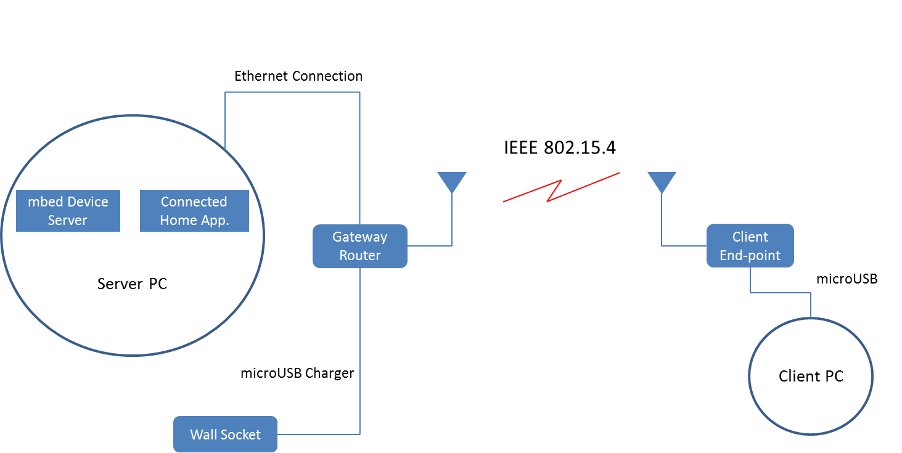
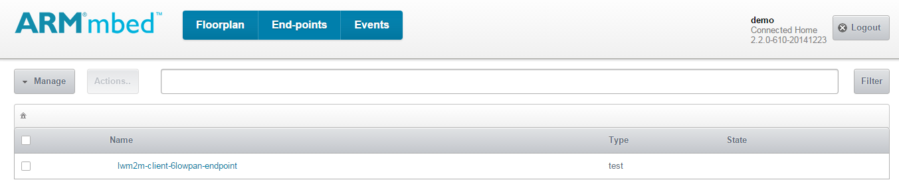
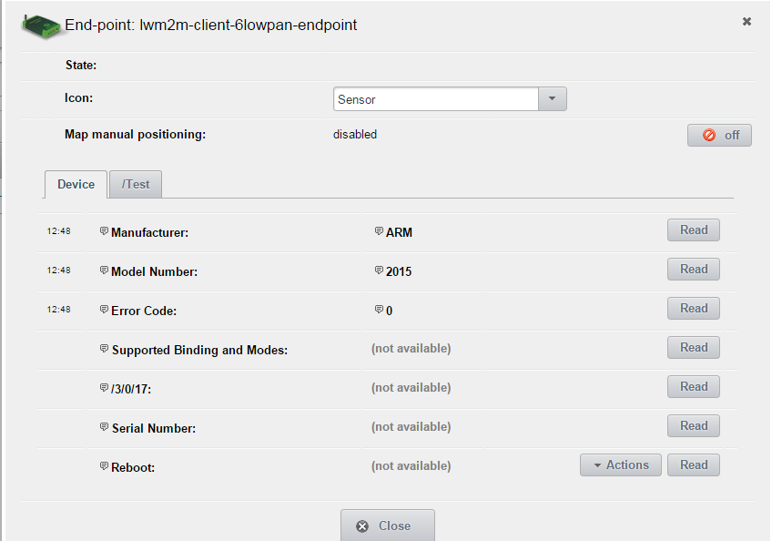
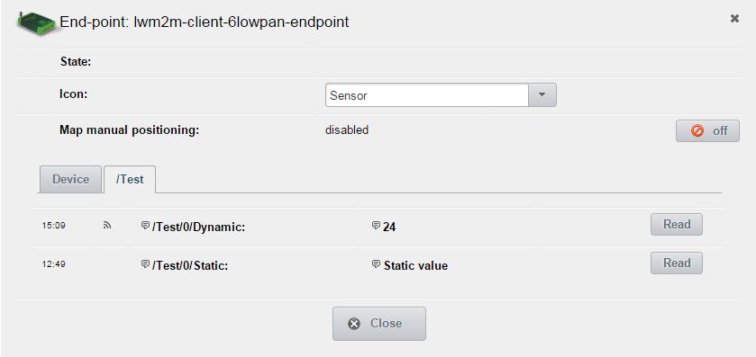
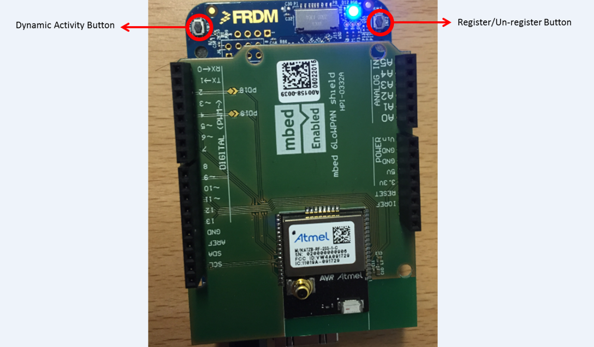

# Getting started with mesh networking

This document describes how to use mesh networking to communicate with mbed Device Server (mDS).

This example application demonstrates how to:

* Connect to a **6LoWPAN ND** or **Thread** type of mesh network.
* Register, read resource values and send observations to mDS.
* Deregister from mDS.
* Disconnect from the network.

## Switching to Thread

By default, the example application makes a **6LoWPAN ND** bootstrap. To change the bootstrap mode to **Thread**
you need to define (uncomment) the macro `APPL_BOOTSTRAP_MODE_THREAD` in the file `source/main.cpp`. 

## Required hardware

* An FRDM-K64F development board (client end-point).
* An mbed 6LoWPAN shield (with a radio module).
* An mbed 6LoWPAN Gateway router.
* A micro-USB cable.
* A micro-USB charger for powering the mbed 6LoWPAN Gateway router.
* An Ethernet cable.
* A computer running mDS.

 


## Required software

* [yotta](http://docs.yottabuild.org/#installing) - to build the example programs.
* [mbed Device Server (mDS)](https://silver.arm.com/browse/SEN00) - what the example application connects to.

## Optional software
* [Wireshark](https://www.wireshark.org/) - for packet inspection and network debugging.
* [PuTTY](http://www.chiark.greenend.org.uk/~sgtatham/putty/download.html) - for serial terminal emulation.

## Reference block diagram
- **Static setup block diagram**

 

- **Dynamic setup block diagram**
 

* Connect the Gateway router with an Ethernet cable to the Ethernet card of the local machine running mDS or to a router/L3 switch. 

* To power up the Gateway router use a micro-USB charger connected to a wall socket or a micro-USB cable connected to a computer.

* To flash the Gateway router with the firmware, you need a micro-USB cable (see flashing instructions below).

* The wireless link between the FRDM-K64F board (client end-point) and the Gateway router follows the IEEE 802.15.4 standard. 

* To power up the FRDM-K64F board (client end-point) use either a micro-USB charger or a micro-USB cable. If you are using micro-USB, you can view the debug and trace messages using third party software like PuTTY.

**Note!**  
	
* If you are using a virtual machine, please set your network adapter mode to 'Bridged'.

* For static setup: If you are using a docking board with a laptop, connect your Ethernet cable to the docking board RJ45 female connector rather than the laptop's own RJ45 female connector. 

* If you have access to an IPv6 network but don't have access to a globally running mDS instance, you can still test the dynamic setup by running a local instance of mDS.

##Test environment setup
The test environment for this example can be set up in two modes:

1. **Static setup:** Where an mDS instance is running on a local machine and the Gateway router is connected directly to that machine using an Ethernet cable.

2. **Dynamic setup:** Where an mDS instance is running in the IPv6-enabled cloud or behind a global IPv6 network. In that case, the Gateway Router is connected to a physical network router or switch.

   
### Server side configuration

1. Use an Ethernet cable to connect the mbed 6LoWPAN Gateway router to a computer running mDS.

2. Use a micro-USB cable to connect the mbed 6LoWPAN Gateway router to your computer. The computer will list the router as removable storage.

3. The firmware for the Gateway is located in the `GW_Binary` folder in the root of this example. You should select the binary matching your application bootstrap mode:

	* For **static setup** with the **6LoWPAN ND** bootstrap, use `gateway6LoWPANStatic.bin`.
	* For **static setup** with the **Thread** bootstrap, use `gatewayThreadStatic.bin`.

4. If you have access to a global IPv6 network, you can also try dynamic setup (otherwise skip it and carry on with static setup):

	* For **Dynamic Setup** with the **6LoWPAN ND** bootstrap, use `gateway6LoWPANDynamic.bin`.
	* For **Dynamic Setup** with the **Thread** bootstrap, use `gatewayThreadDynamic.bin`.

4. Copy the gateway binary file to the mbed 6LoWPAN Gateway router to flash the device. The device will reboot automatically after flashing. If that does not happen, push the **Reset** button on the board.

5. Download and run mDS on your computer (see instructions below).


#### Static setup configuration (_Server Side_)


As mentioned above, in static setup the mDS instance runs on a local computer with a statically configured IPv6 address. The example application running on the client side will register with the mDS creating a 6LoWPAN network. 

Please follow the instructions below to complete the setup.

##### Downloading mDS

Installing mDS on your computer:

1. Download the free developer version of mDS from [ARM silver](https://silver.arm.com/browse/SEN00).
2. Click the **Download Now** button in the right hand side pane.  
3. Unzip the package on your computer. You should see the following files:

```
Device Server.tar.gz
Device Server Clients.tar.gz
Device Server Tools.tar.gz
Ref Apps.tar.gz
```

**Note:** These instructions are valid for the Device Server 2.2 release.

##### Starting mDS

1. Extract the `Device Server.tar.gz` file.
2. Go to the `bin` folder of the `Device Server` package that you just extracted.
3. Run the start script:
    - If you are running mDS on Linux, run `runDS.sh` in a new shell.
    - If you are running mDS on Windows, run `runDS.bat` in a new command prompt.
		
This will start mDS on your system.

##### Starting the web UI (_Connected_ _home_ _reference_ _app_)

1. Extract the `Ref Apps.tar.gz` file.
2. Go to the `bin` folder in the `Connected-home-trial` reference app that you extracted.
3. Run the start script:	
    - If you are running mDS on Linux, run `runConnectedHome.sh` in a new shell.	
    - If you are running mDS on Windows, run `runConnectedHome.bat` in a new command prompt.	
		
This will start the web UI on your system.


##### Setting up a static IP address


* Set your computer to use the IP address `fd00:ff1:ce0b:a5e0::1` .

* Use the 64-bit network mask `fd00:ff1:ce0b:a5e0::1/64`.

Note: Make sure that the computer running mDS is **not** connected to the internet.


**IP settings in Windows:**

1. Read [**Microsoft: Changing TCP/IP settings**](http://windows.microsoft.com/en-gb/windows/change-tcp-ip-settings).

2. Go to **IPv6 properties**.

3. Select **Use following**.

4. Enter `fd00:ff1:ce0b:a5e0::1`.

5. Enter subnet prefix length: `64`.

6. Click **OK**.

**Note!**  
If you need a separate driver for Windows, [download](https://developer.mbed.org/handbook/Windows-serial-configuration) the mbed Windows Serial Port driver.

**IP setting in Linux:**

```
ifconfig eth0 add fd00:ff1:ce0b:a5e0::1/64
```

#### Dynamic setup configuration (_Server Side_)


**Note:** This section applies only if you plan to run mDS in a networked environment and have access to a global IPv6 network.

- The binaries `gateway6LoWPANDynamic.bin` and `gatewayThreadDynamic.bin` will work when mDS is running on the IPv6 network. You should use the binary that corresponds to your application bootstrap mode and flash it according to the instructions above. In dynamic setup, the mbed 6LoWPAN Gateway will dynamically learn the network prefix from the IPv6 network it is connected to.

- If you have a remote mDS instance running behind the IPv6 network (or IPv6-enabled cloud), you don't have to configure anything. However, if you plan to run your own instance of mDS on your network, please read the information provided below.

##### How to check if you have a valid IPv6 network

Please follow the instructions below to check whether you have access to a valid IPv6 network.

** Windows:**
	
1. Go to **Network and Sharing Center**.

2. Click the link **Local Area Connection**.

3. From the menu, select **Details**.

4. In the **Network Connection Details** menu, look for **IPv6 address**.

5. If an **IPv6 address** is defined there, you have a valid IPv6 network.

6. Another way of checking the same information:

	- Open a command prompt.

	- Type **ipconfig**.

	- Check whether your Ethernet interface has a global scope IPv6 address. If it does, then you have a valid IPv6 network.

** Linux (Ubuntu) :**

1. Open a terminal and write the command **ifconfig**.

2. Check the Ethernet interface (eth0) status.

3. If you see an IPv6 address with global scope, you have a valid IPv6 network. For example: 

	- inet6 addr: xxxx:xxxx:xxxx:xxxx:xxxx:xxxx:xxxx:xxxx/prefix Scope:Global

4. If you are sure that you have IPv6 access but Linux (especially running as a virtual machine) is not showing it, then it could be an issue of duplicate address detection (DAD). To check if this is the problem:

	- Disconnect and reconnect the Ethernet cable from your Ethernet card.

	- Open the terminal and type **dmesg**.

	- If you have duplicate address detection, then use the following command to disable the DAD:

	```
	sudo sysctl net.ipv6.conf.eth0.accept_dad=0
	```
	
	- Use **ifconfig** again; you should have an IPv6 address with a global scope now.


**Note !**

You do not have access to a global IPv6 network if you:

* See only a link local address (starts with "fe80").

* See only a unique local address (starts with "fd00").


## Client side configuration

For client side configuration, please follow the steps below.

#### Static setup configuration (_Client Side_)

1. Connect the FRDM-K64F development board to the mbed 6LoWPAN shield.

2. Configure the `mbed-client-example-6lowpan` application to use the IPv6 address of mDS:
    * On Windows:
         * On the computer running the mDS, open the command prompt and type _ipconfig_.
         * The section **Ethernet adapter Local Area Connection** in the field **IPv6 address** contains the IPv6 address.
    * On Mac OS X and Linux:
         * On a Mac or a Linux machine running mDS, open the terminal and type _ifconfig_.
         * Under the appropriate device (usually `eth0`, `en0`, or something similar), look for the `inet6` address that looks similar to `FD00:FF1:CE0B:A5E1:1068:AF13:9B61:D557`. That is your IPv6 address.
    * Copy the IPv6 address to the string `MBED_SERVER_ADDRESS` at line 11 in the file `/source/lwm2mclient.cpp`.
    * The address format is `coap://<IPv6 address>:PORT`. For example, if your server's IP address is `FD00:FF1:CE0B:A5E1:1068:AF13:9B61:D557`, you would enter `coap://FD00:FF1:CE0B:A5E1:1068:AF13:9B61:D557:5683` (where `5683` is the port number). The  prefix `FD` tells you that it is a unique local IPv6 address.

3. Build `mbed-client-example-6lowpan` with `yotta` (see [Build instructions](#build-instructions)).

4. Configure the `mbed-client-example-6lowpan` application to use an appropriate radio channel based on your hardware:
	* Open the file `yotta_modules/mbed-mesh-api/source/include/static_config.h`.
    	* For **6LoWPAN-ND**, change the macro `SCAN_CHANNEL_LIST` to either **4** (1<<4) or **12** (1<<12).
        * For **Thread**, change the macro `THREAD_RF_CHANNEL` to either **4** or **12**.	
	* Use channel 4 for a sub-GHz module and channel 12 for a 2.4 GHz module.
	* To identify which radio module you have, see the section [Radio Module Identification](#radio-module-identification).

5. Build the application again using the command `yotta build`.

6. Load the `mbed-client-example-6lowpan` application binary to the FRDM-K64F board (see [Running the example application](#running-the-example-application)).

7. Make sure that the `/source/lwm2mclient.cpp` file contains the right IPv6 address for mDS. By default, this is set to  "FD00:FF1:CE0B:A5E0::1". It should be at line 27, as the value of `MBED_SERVER_ADDRESS`. The full address format is `coap://<IPv6 address>:PORT`, that is "FD00:FF1:CE0B:A5E0::1:5386".

	Notice that this is the same IP address you just set for your mDS machine in the section Server Side Configuration.

3. Configure the `mbed-client-example-6lowpan` application to use an appropriate radio channel based on your hardware. See [Changing radio channel below](#changing-radio-channel) for instructions.

4. Build `mbed-client-example-6lowpan` with `yotta`. See [Build instructions below](#build-instructions).

5. Load the `mbed-client-example-6lowpan` application binary to the FRDM-K64F board. See [Running the example application below](#running-the-example-application).

#### Dynamic setup configuration (_Client Side_)

Dynamic setup follows the same steps detailed above, with one exception:
 	
* The string `MBED_SERVER_ADDRESS` gets the IPv6 address of the remote server machine that is running the mDS instance.

**Note:** You may need to open UDP port 5683 in your computer's firewall for mDS to communicate with this example application. 

#### Changing radio channel

To change the radio channel you use:

* Clone the `mbed-mesh-api` repository to your work area:

```
git clone git@github.com:ARMmbed/mbed-mesh-api.git
```

* Modify the source code:

	- In your copy of the `mbed-mesh-api` repository, find the file  `./source/include/static_config.h`.

	- You'll need to use channel **1** for a sub-GHz module and channel **12** for a 2.4 GHz module.

		Tip: To identify which radio module you have, see the section [Radio Module Identification](#radio-module-identification).

		- For **6LoWPAN-ND**, change the macro `SCAN_CHANNEL_LIST` to either **1** (1<<1) or **12** (1<<12).

		- For **Thread**, change the macro `THREAD_RF_CHANNEL` to either **1** or **12**.	
* Create a yotta link to your code:

	```
	cd mbed-mesh-api
	yt link
	```
* Go back to the `mbed-client-example-6lowpan` application folder and make a link to the cloned `mbed-mesh-api` repository:

	```
	cd mbed-client-example-6lowpan
	yt link mbed-mesh-api
	```

* You can check that linking was successful by using the command `yt ls` and checking that the module `mbed-mesh-api` points to the cloned repository.

#### Radio module identification

* Make sure that you are using the same radio modules on both server and client sides:

	* If the radio module on the Gateway router supports the 2.4 GHz frequency band, you must use an mbed 6LoWPAN shield on the client side that uses a 2.4 GHz radio module (such as Atmel RF-233).

	* If the radio module on the Gateway router supports the sub-GHz frequency band, you must use an mbed 6LoWPAN shield on the client side that uses a sub-GHz radio module (such as Atmel RF-212B).

* An easy way to identify which frequency band your setup uses is to check the **Antenna size** on the radio module:

	* The sub-GHz band antenna is larger than the 2.4 GHz antenna.

	* For the client side (mbed 6LoWPAN shield connected to an FRDM-K64F board), see the image below:
   

	* For the Gateway router, see the image below:
   


## Build instructions
		
1. Install yotta. See instructions [here](http://docs.yottabuild.org/#installing). On Linux, enter `pip install --pre pyusb` and then `pip install yotta`.

2. Install the necessary toolchains. See [Required software](#required-software). 

4. Set the `IPv6` address for mDS in `source/lwm2mclient.cpp` if you have not done it yet. The instructions are in the [Client side](#client-side) section of this document. 

5. In the command line, move to the root of this example application.

6. Set up the target device: `yotta target frdm-k64f-gcc`.

7. Build the binary: `yotta build`.

The executable file will be created in the `/build/frdm-k64f-gcc/source/` folder.

## Running the example application

1. Find the  binary file `mbed-client-example-6lowpan.bin` in the folder `mbed-client-example-6lowpan/build/frdm-k64f-gcc/source/`.

2. Copy the binary to the USB mass storage root of the FRDM-K64F development board. It will be automatically flashed to the target MCU. After flashing, the board will restart itself. Press the **Reset** button of the development board if it does not restart automatically.

4. The program starts up and will begin registration with mDS.

5. After a successful registration, the program will automatically start sending observations every 10 seconds.

## Test usage

* Make sure that mDS and the Connected Home app are up and running.

* On the server side where mDS is running, open a browser tab and type:


	```
	//localhost:8082
	```

* Use the following username and password:

	```
	User-name = demo
	Password = demo
	```

* The web UI for the Connected Home application opens. Click on the **End-points** tab.

 

* Click **lwm2m-client-6lowpan-endpoint**. It will bring you to a panel where you will see panes called **Device** and **Test**:

  

* Click the **Read** button to retrieve information from the client:

* Open the **Test** pane.

* Click the **Read** buttons. **/Test/0/Static** returns a `Static value` string whereas **/Test/0/Dynamic** returns the count of button presses on the client board:

 

* Press the **Dynamic Activity** button on the board (indicated in the image):

 

* You should be able to see an increment in the **/Test/0/Dynamic** count.

* Press the **Register** button (indicated in the image below) to deregister your device from mDS. You will see that the end-point has been removed from the web UI and the device status is `Stale` in the Connected Home app.

* To register your device again, simply press the **Restart** button.

## Debug trace on client side

To see the debug trace for the mbed client, you can use either Wireshark or some terminal emulation software. 

The following is an example of using PuTTY and Linux:

1. On the client side computer, open PuTTY with root privileges: `$ sudo putty`.

2. Give the command `dmesg`to see which serial port your mbed client controller is connected to.

3. Go to the **Serial** category in PuTTY.

4. Type your identified port in the section **Serial line to connect to**, for example `/dev/ttyACM0`.

5. In the **Configure the serial line** section, enter the following details:

	* Baud-rate = 115200.
	* Data bits = 8.
	* Stop bits = 1.
	* flow control = xon/xoff.

6. Click the **Session** category. Give the session a name, for example `mbed_trace`, and save it.

7. Select **Connection_type** as `Serial`.

8. Click **Open**.

This will give you the client's debug trace.
