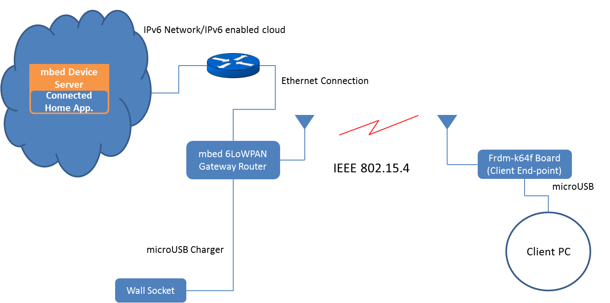

*Note:* this example is based on mbed OS 3.0 and now superseded by the [mbed Client example based on mbed OS 5](https://github.com/ARMmbed/mbed-os-example-client)

# Getting started with mesh networking

This document describes how to use mesh networking to communicate with [ARM mbed Device Connector](https://connector.mbed.com) 
that is a new web service hosted by ARM.

This example application demonstrates how to:

* Connect a client to a **6LoWPAN ND** or **Thread** type of mesh network.
* Register, read resource values and send observations to ARM mbed Device Connector.
* Deregister from ARM mbed Device Connector.
* Disconnect the client from the mesh network.

## Switching to Thread

By default, the example application makes a **6LoWPAN ND** type of bootstrap. To change the bootstrap mode to **Thread**
you need to change value of the `appl_bootstrap_mode_thread` to `true` in the `config.json` file before building the project.

### Change Thread device type

In the Thread bootstrap mode, the device type can be either **Router** or **Sleepy End Device**. By default, the device type is set to **Router** but the type can be changed to **Sleepy End Device** by changing the parameter `device_type` from `MESH_DEVICE_TYPE_THREAD_ROUTER` to value `MESH_DEVICE_TYPE_THREAD_SLEEPY_END_DEVICE` in the `config.json` file.

A list of all application configurable items can be found from [Application configurable items](#application-configurable-items).

## Required hardware

* An [FRDM-K64F](https://developer.mbed.org/platforms/FRDM-K64F/) development board (client end-point).
* An mbed [6LoWPAN shield](https://firefly-iot.com/product/firefly-arduino-shield-2-4ghz/) (with a radio module).
* An mbed [6LoWPAN gateway router](https://firefly-iot.com/product/firefly-6lowpan-gateway-2-4ghz/).
* A micro-USB cable.
* A micro-USB charger for powering the mbed 6LoWPAN gateway router.
* An Ethernet cable.


## Required software

* [yotta](http://docs.yottabuild.org/#installing) to build the example programs.
* [ARM mbed Device Connector website](https://connector.mbed.com) - Web service running on the internet.


## Optional software

* [Wireshark](https://www.wireshark.org/) for packet inspection and network debugging.
* [PuTTY](http://www.chiark.greenend.org.uk/~sgtatham/putty/download.html) for serial terminal emulation.


## Reference block diagram

- **Setup block diagram**
 

* Connect the gateway router with an Ethernet cable to a router/L3 switch. 

* To power up the gateway router, use a micro-USB charger connected to a wall socket or a micro-USB cable connected to a computer.

* To flash the gateway router with the firmware, you need a micro-USB cable (see gateway flashing instructions below).

* The wireless link between the FRDM-K64F board (client endpoint) and the gateway router follows the IEEE 802.15.4 standard.

* To power up the FRDM-K64F board (client endpoint), use either a micro-USB charger or a micro-USB cable. If you are using micro-USB cable, you can view the debug and trace messages using third party software such as PuTTY.

<span class="notes">**Note!**: If you are using a virtual machine, please set your network adapter mode to **Bridged**.</span>


## Setting up the environment

To set up the environment, you need to configure the mbed 6LoWPAN gateway router and the client.

### Gateway configuration

1. Use an Ethernet cable to connect the mbed 6LoWPAN gateway router to the internet.

2. Use a micro-USB cable to connect the mbed 6LoWPAN gateway router to your computer. The computer will list the router as removable storage.

3. The firmware for the gateway is located in the `GW_Binary` folder in the root of this example. You should select the binary matching your application bootstrap mode.

	* For the **6LoWPAN ND** bootstrap, use `gateway6LoWPANDynamic.bin`.
	* For the **Thread** bootstrap, use `gatewayThreadDynamic.bin`.

4. Copy the gateway binary file to the mbed 6LoWPAN gateway router to flash the device. The device will reboot automatically after flashing. If that does not happen, push the **Reset** button on the board.

### Client side configuration

#### Setting the certificate for the application

First you need to create and set a certificate for the client application.

1. Open the [mbed Device Connector website](https://connector.mbed.com) and log in with your mbed.org account.
2. Navigate to **Security credentials** under **My devices**.
3. Click **GET MY DEVICE SECURITY CREDENTIALS**. You will get the needed certificate information as well as the endpoint name and domain.
4. Copy the created security credentials to file `source/security.h`.

To further configure the client side application, proceed as follows:

1. Configure the `mbed-client-example-6lowpan` application to use the IPv6 address of ARM mbed Device Connector:
	* You can get the mbed Device Connector IPv6 address by using the command `nslookup -query=AAAA api.connector.mbed.com`.
	* The `config.json` file contains the IPv6 address of ARM mbed Device Connector. By default, this is set to `2607:f0d0:2601:52::20`. It can be found on line 3, as the value of `device_connector_uri`. The full address format is `coap://<IPv6 address>:PORT`, that is `coap://2607:f0d0:2601:52::20:5684`. Please note that IPv6 address is presented as a string that must be escaped `"\"coap:\/\/2607:f0d0:2601:52::20:5684\""`.
2. Configure the `mbed-client-example-6lowpan` application to use an appropriate radio channel based on your hardware. See [Changing the radio channel](#changing-the-radio-channel) section for instructions.
3. Build `mbed-client-example-6lowpan` (see [Build instructions](#build-instructions)).
4. Load the `mbed-client-example-6lowpan` application binary to the FRDM-K64F board (see [Running the example application](#running-the-example-application)).

<span class="notes">**Note:** You may need to open UDP port 5684 in your computer's firewall for ARM mbed Device Connector to communicate with this example application.</span>

#### IP address setup

This example uses IPv6 to communicate with the [mbed Device Connector Server](https://api.connector.mbed.com). The example program should automatically get an IPv6 address from the mbed 6LoWPAN gateway router when it is connected via Ethernet.

#### Changing the radio channel

To change the radio channel you are using you need to modify the `config.json` file that contains sections for the **Thread** and **6LoWPAN-ND** configuration. Use channel **1** and channel page **2** for a sub-GHz module. Use channel **12** and channel page **0** for a 2.4 GHz module.

**Tip:** To identify which radio module you have, see the section [Radio Module Identification](#radio-module-identification).

* To change the radio channel, modify the `config.json` file:

	- For **6LoWPAN-ND**, change the value of `channel` to either **1** or **12** in section `6lowpan_nd`.

	- For **Thread**, change the value of `channel` to either **1** or **12** in section `thread`.

	- For **sub-GHz** module set value of `channel_page` to **2**.

	- For **2.4 GHz** module set value of `channel_page` to **0**.
	

#### Radio module identification

* Make sure that you are using the same radio modules on both server and client sides:

	* If the radio module on the gateway router supports the 2.4 GHz frequency band, the client side must have an mbed 6LoWPAN shield that uses a 2.4 GHz radio module (such as Atmel AT86RF233).

	* If the radio module on the gateway router supports the sub-GHz frequency band, the client side must have an mbed 6LoWPAN shield that uses a sub-GHz radio module (such as Atmel AT86RF212B).

* An easy way to identify which frequency band your setup uses is to check the **Antenna size** on the radio module:

	* The sub-GHz band antenna is larger than the 2.4 GHz antenna.

	* For the client side (mbed 6LoWPAN shield connected to an FRDM-K64F board), see the image below:
   

	* For the gateway router, see the image below:
   


## Build instructions
		
1. Install yotta. See instructions [here](http://docs.yottabuild.org/#installing). On Linux, enter `pip install --pre pyusb` and then `pip install yotta`.

2. Set the `IPv6` address for ARM mbed Device Connector if you have not done it yet. The instructions are in the [Client side configuration](#client-side-configuration) section of this document. 

3. In the command line, move to the root of this example application.

4. Set up the target device: `yotta target frdm-k64f-gcc`.

5. Build the binary: `yotta build`.

The executable file will be created in the `/build/frdm-k64f-gcc/source/` folder.

### Application configurable items

Application configurable parameters are collected to the `config.json` file. The tables below contain a summary of the application configurable items:

Configuration values in top level:

| Name                       | Value         | Description |
| -------------------------- | ------------- | ----------- |
| appl_bootstrap_mode_thread | [true, false] | Set application bootstrap mode to Thread (true) or 6LoWPAN ND (false). |
| device_connector_uri       | string        | IPv6 address of ARM mbed Device Connector. |

6LoWPAN-ND specific configuration values in section: mbed-mesh-api/6lowpan_nd:

| Parameter name  | Type     | Description |
| --------------- | ---------| ----------- |
| channel_page    | number (0, 2) | 0 for 2,4 GHz and 2 for sub-GHz radios. |
| channel         | number [0-27] | RF channel to use. |

Thread specific configuration values in section: mbed-mesh-api/thread

| Parameter name  | Value         | Description |
| --------------- | ------------- | ----------- |
| device_type     | enum from mbed-mesh-api `mesh_device_type_t` | Set device operating mode to Router (`MESH_DEVICE_TYPE_THREAD_ROUTER`) or Sleepy End Device (`MESH_DEVICE_TYPE_THREAD_SLEEPY_END_DEVICE`). |
| channel_mask    | number        | Channel(s) to scan, 1 << channel number. |
| channel_page    | number [0, 2] | Channel page, 0 for 2,4 GHz and 2 for sub-GHz radios. |
| channel         | number [0-27] | RF channel to use. |


## Running the example application

1. Find the  binary file `mbed-client-example-6lowpan.bin` in the folder `mbed-client-example-6lowpan/build/frdm-k64f-gcc/source/`.

2. Copy the binary to the USB mass storage root of the FRDM-K64F development board. It will be automatically flashed to the target MCU. After flashing, the board will restart itself. Press the **Reset** button of the development board if it does not restart automatically.

3. The program starts up and begins registration with ARM mbed Device Connector.

4. After a successful registration, the program will automatically start sending observations every 10 seconds.


## Test usage

### Testing the example application with mbed Device Connector

**Step 1**: Open the [mbed Device Connector website](https://connector.mbed.com).

**Step 2**: Log in using your mbed account.

**Step 3**: Click the **Connected devices** link under **My devices** to see your registered devices.

**Step 4**: To send requests to mbed Client device with mbed Device Connector API, click **API Console** under **mbed Device Connector**. Click the URL textbox to create a request. The textbox will show a list of registered resources. After selecting the resource, click **TEST API** to send the request.

The **/Test/0/S** represents the static resource that is a fixed value set in the example application. 

For example: `https://api.connector.mbed.com/endpoints/<ENDPOINT_NAME>/Test/0/S?sync=true`, where `<ENDPOINT_NAME>` is the name of the connected device. It creates a request to the **/Test/0/S** resource.

The **/Test/0/D** represents the dynamic resource that can be read by mbed Device Connector. It is linked with the **SW2** button on the FRDM board. The value starts from zero and every time you press the **SW2** button the node increases the counter value by 1. You can make a CoAP request to the node resources to get the latest value. To do that, click **API Console** under **mbed Device Connector**. Click the URL textbox to create a request.

For example: `https://api.connector.mbed.com/endpoints/<ENDPOINT_NAME>/Test/0/D?sync=true`, where `<ENDPOINT_NAME>` is the name of the connected device, creates a GET request to the **/Test/0/D** resource. This returns the latest value of **/Test/0/D**. 

<span class="notes">**Note:** If you get, for example, an error `Server Response:410(Gone)` or other such error, clear the cache of your browser, log out and log in again.</span>

For more information on the mbed Device Connector REST API, see the [help pages](https://connector.mbed.com/#help-rest-api).

**Step 5**: If you press the **SW3** button, the endpoint sends a deregister message to mbed Device Connector. After a successful deregistration, LED **D12** starts blinking indicating that the application has successfully completed the task.


### Debug trace on client side

To see the debug trace for mbed Client, you can use either Wireshark or terminal emulation software.

The following is an example of using PuTTY and Linux:

1. Open PuTTY with root privileges: `$ sudo putty`.

2. Give the command `dmesg`to see which serial port your mbed Client controller is connected to.

3. Go to the **Serial** category in PuTTY.

4. Type your identified port in the section **Serial line to connect to**, for example `/dev/ttyACM0`.

5. In the **Configure the serial line** section, enter the following details:

	* Baud-rate = 115200.
	* Data bits = 8.
	* Stop bits = 1.
	* flow control = xon/xoff.

6. Click the **Session** category. Give the session a name, for example `mbed_trace`, and save it.

7. Select **Connection_type** `Serial`.

8. Click **Open**.

This will give you the client's debug trace.

## Troubleshooting

If your endpoint is not visible in the ARM mbed Device Connector **Connected devices** link under **My devices** try one of the following:

* Clear your browser cache.
* Unplug the FRDM-K64F board and restart the 6LoWPAN gateway.
* Start the FRDM-K64F board.

You can also check the following settings:

* Check that channels are set as described in [Changing the radio channel](#changing-the-radio-channel).
* Check that the mbed 6LoWPAN gateway is using the correct binary, as explained in [Gateway configuration](#gateway-configuration).
* Check that the ARM mbed Device Connector address is set as described in [Client side configuration](#client-side-configuration).
* Check that you have working IPv6 connection by pinging the IPv6 address of ARM mbed Device Connector.
* Check the trace from mbed 6LoWPAN Gateway using baud rate 460800. IPv6 address is correctly configured to the gateway if following trace is visible: `Eth bootstrap ready, IP=XXXX:XXXX:XXXX:XXXX:XXXX:XXXX:XXXX:XXXX`.
* Check the client trace. It should indicate that the bootstrap is ready when the FRDM-K64F board is connected to the mbed 6LoWPAN gateway.
* **[Applicable only to 6LoWPAN ND bootstrap mode]** If you are not using the Gateway binary provided, using for example the [K64F border router](https://github.com/ARMmbed/k64f-border-router), make sure that you have configured the link layer security.
 
```json
 "6lowpan_nd": {
  "channel_page": 0,
  "channel": 12,
  "security_mode": "PSK"
}
```  

### Traces in 6LoWPAN ND bootstrap mode

The **6LoWPAN ND** bootstrap trace window indicates the bootstrap state and object registration as follows:

```
[INFO][m6LND]: 6LoWPAN ND bootstrap ready
...
[DBG ][m6LND]: Channel: 1
[DBG ][mbedclient]: mesh_network_handler() 0
[DBG ][mbedclient]: waiting 15s before sending registration...
[DBG ][mbedclient]: send_registration()
...
[DBG ][mbedclient]: object_registered()

```

### Traces in Thread bootstrap mode

In the **Thread** bootstrap mode the trace should be as follows:

```
Start mbed-client-example-6lowpan
[DBG ][m6La]: init()
[DBG ][m6La]: connect()
[DBG ][m6Thread]: PANID defa
[DBG ][m6Thread]: channel: 12
[DBG ][m6Thread]: channel page: 0
[DBG ][m6Thread]: channel mask: 134215680
[DBG ][m6Thread]: Mesh prefix: fd:00:0d:b8:00:00:00:00
[DBG ][m6Thread]: Master key: 00:11:22:33:44:55:66:77:88:99:aa:bb:cc:dd:ee:ff
[DBG ][m6Thread]: PSKc: 00:11:22:33:44:55:66:77:88:99:aa:bb:cc:dd:ee:ff
[DBG ][m6Thread]: PSKd: Secret password
[INFO][m6Thread]: Start Thread bootstrap (Router mode)
[DBG ][m6Thread]: app_parse_network_event() 0
[INFO][m6Thread]: Thread bootstrap ready
[DBG ][m6Thread]: MAC 16-bit: 04:00
[DBG ][m6Thread]: PAN ID: de:fa
[DBG ][m6Thread]: MAC 64-bit: fe:c2:3d:00:00:05:2f:8e
[DBG ][m6Thread]: IID (Based on MAC 64-bit address): fc:c2:3d:00:00:05:2f:8e
mesh_network_handler() 0
[DBG ][ns_wrap]: ns_wrapper_socket_open(5)
waiting 5s before sending registration...
send_registration()
[DBG ][ns_wrap]: SOCKET_TX_DONE, 163 bytes sent
[DBG ][ns_wrap]: SOCKET_DATA, sock=5, bytes=60
[DBG ][ns_wrap]: SOCKET_TX_DONE, 195 bytes sent
[DBG ][ns_wrap]: SOCKET_DATA, sock=5, bytes=112
...
object_registered()
...
```

In case of an error in IPv6 connectivity, the trace will look as follows:

```
...
send_registration()
[DBG ][ns_wrap]: SOCKET_TX_DONE, 163 bytes sent
[DBG ][ns_wrap]: SOCKET_TX_DONE, 163 bytes sent
[DBG ][ns_wrap]: SOCKET_TX_DONE, 163 bytes sent
error 6
Reconnecting to server
[DBG ][ns_wrap]: ns_wrapper_socket_free(8)
[DBG ][ns_wrap]: ns_wrapper_socket_open(9)
waiting 5s before sending registration...
send_registration()
[DBG ][ns_wrap]: SOCKET_TX_DONE, 163 bytes sent
[DBG ][ns_wrap]: SOCKET_TX_DONE, 163 bytes sent
[DBG ][ns_wrap]: SOCKET_TX_DONE, 163 bytes sent
error 6
...
```

