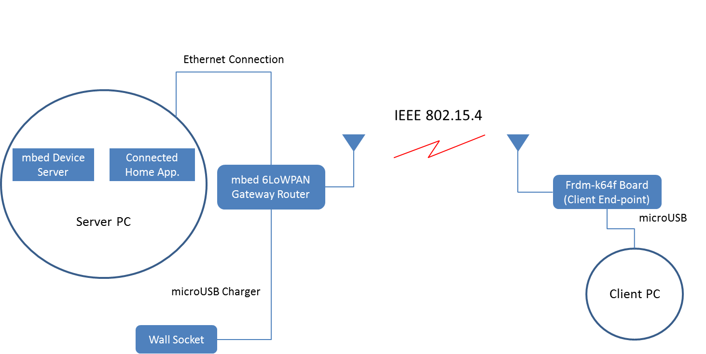

# Getting started with mesh networking

This document describes how to use mesh networking to communicate with mbed Device Server.

This example application demonstrates how to:

* connect to a 6LoWPAN ND type of mesh network
* register, unregister, read resource values and send observations to mbed Device Server
* disconnect from the network

## Required hardware

* An `Frdm-k64f` development board (Client end-point)
* An mbed 6LoWPAN shield (with Radio Module)
* An mbed 6LoWPAN `Gateway router` (ST Nucleo F401RE)
* A micro-USB cable
* A micro-USB charger for powering mbed 6LoWPAN Gateway
* Ethernet Cable
* A PC running `mbed Device Server (mDS)`

## Required software

* [Yotta](http://docs.yottabuild.org/#installing) - to build the example programs.
* [mbed Device Server (mDS)](https://silver.arm.com/browse/SEN00) - mbed Device Server, where example application connects.

## Optional software
* [Wireshark](https://www.wireshark.org/) - for packet inspection/network debugging.
* [Putty](http://www.chiark.greenend.org.uk/~sgtatham/putty/download.html) - for serial terminal emulation

## Reference Block Diagram
 

* The communication link between the `Gateway router` and `mbed Device Server` is Ethernet. 
* The `Gateway router` is powered up using a microUSB Charger connected to a wall socket.
* In order to flash the `Gateway router` with the `Gateway router firmware`, you need a microUSB cable . (See instructions below)
* You can also power up your `Gateway router` with microUSB cable connected to the PC if you do not have a microUSB charger.
* The wireless link between `Frdm-k64f (Client end-point)` and `Gateway router` is following `IEEE 802.15.4` standard. 
* The `Frdm-k64f (Client end-point)` can also be powered up by either a microUSB charger or a microUSB cable. If microUSB is used, debug/trace messages can be viewed utilizing an optional software listed above, e.g., Putty.

##Test environment setup
#### Server Side

* Connect mbed 6LoWPAN `Gateway Router` to PC running mDS with ethernet cable. 
* Connect micro-USB cable to mbed 6LoWPAN `Gateway Router`.  It will be shown in your computer as a removable memory
* The firmware for Gateway `mbed_6LP_Gateway.bin`, is located in the `GW_Binary` folder in the root of this example. 
* Copy the `mbed_6LP_Gateway.bin` file to the mbed 6LoWPAN `Gateway router` in order to flash the device. The device will reboot automatically after flashing. If it does not happen, push the **Reset** button on the board.
* Download and run mDS server on PC (see instructions below).

**Note!**  For Windows OS: A seperate driver is needed. [Download](https://developer.mbed.org/handbook/Windows-serial-configuration) the mbed Windows Serial Port driver.

#### Client Side
* Connect `Frdm-k64f` development board and mbed 6LoWPAN shield together.
* Configure the `lwm2m-client-6lowpan-example` application in order to use `Device Server(mDS)` IPv6 address.
    * in the PC running `mDS` open command prompt and type _ipconfig_
    * section `Ethernet adapter Local Area Connection` field `IPv6 address` contains IPv6 address
    * copy IPv6 address to the String`MBED_SERVER_ADDRESS` at line no. 11 in the file `./source/lwm2mclient.cpp`
    *  Address format is `coap://<IPv6 address>:PORT`. For example, if your server's IP address is `FD00:FF1:CE0B:A5E1:1068:AF13:9B61:D557`,   you would enter `coap://FD00:FF1:CE0B:A5E1:1068:AF13:9B61:D557:5683` where `5683` is the port number. The `FD` prefix tells us that it is a Unique local IPv6 address.
* Build the `lwm2m-client-6lowpan-example application` with `Yotta` (see `Build instructions` below)
* Load the `lwm2m-client-6lowpan-example application` to the `FRDM-K64F` board. (see `Running the example application` below)

**Note!** You might need to open UDP port 5683 in your computer firewall for mDS to communicate with this example application. 

### Downloading mbed Device Server (mDS)

The example application will register to mbed Device Server. Install mDS on PC.

* The free developer version of the mbed Device Server is used with this example. Download it from [ARM silver](https://silver.arm.com/browse/SEN00).
* Click **Download Now** button in the right hand side pane.  
* Unzip the package on PC. You should see the following files:

**NOTE!** These instructions have been made for Device Server 2.2 release!

~~~
Device Server.tar.gz
Device Server Clients.tar.gz
Device Server Tools.tar.gz
Ref Apps.tar.gz
~~~

### Starting the mbed Device Server (mDS)

* Extract 'Device Server.tar.gz'.
* Go to the `bin` folder of the `Device Server` package that you just extracted.
* Run the start script:
    - If you are running mDS on Linux OS, run the `runDS.sh` in a new shell.
    - If you are running mDS on Windows, run the `runDS.bat` in a new command prompt.
		
This will start the mbed Device Server on your system.

### Starting the WebUI ("Connected home" reference app)

* Extract `Ref Apps.tar.gz`.
* Go to the `bin` folder in the Connected-home-trial reference app that you extracted.
* Run the start script:	
    - If you are running mDS on Linux OS, run the `runConnectedHome.sh` in a new shell.	
    - If you are running mDS on Windows, run the `runConnectedHome.bat` in a new command prompt.	
		
This will start the WebUI on your system.

## Build instructions
		
#### General 
* Install yotta. See instructions [here](http://docs.yottabuild.org/#installing)
* Install the necessary toolchains. Refer to the yotta installation instructions (as in `Required Software` section) to learn how to install the toolchains. 
**Note:** In Linux environment, before using the command:
~~~
 pip install yotta
~~~
 use this command 
~~~
pip install --pre pyusb
~~~    

* Set the `IPv6` address of the `Device Server` in `source/lwm2mclient.cpp` if you have not done it yet. The instructions were given in the subsection `Client Side` of the section named `Test environment setup`. 
* At the command line, move to the root of this example application.
* Set up the target device 
~~~
yotta target frdm-k64f-gcc
~~~
* Build the binary
~~~ 
yotta build
~~~ 
The executable file will be created in `/build/frdm-k64f-gcc/source/` folder.

### Running the example application

* Find the binary file named `lwm2m-client-6lowpan-example.bin` in the folder `lwm2m-client-6lowpan-example/build/frdm-k64f-gcc/source/`.
* Copy the binary to the USB mass storage root of the `frdm-k64f` development board. It will be automatically flashed to target MCU. After flashing, the board will restart itself.
3. Press the reset button of frdm-development board if it does not restarts automatically.
4. The program begins execution and will start registration to the mbed Device Server.
5. After a successful registration, the program will automatically start sending observations after every 10 seconds.

### Test Usage

* Make sure that `Device Server` and `Connected Home App.` are up and running.
* On the server side where `Device Server` is runing, open a browser and write:
~~~
https://localhost:8081
~~~ 
This will open `WebUI` for `Device Server` Admin Control.
*  Click on the tab named `End-points`. You should be able to see `lwm2m endpoint` activated there. An example is shown below.

 

* Open another tab in the browser and write:
~~~
//localhost:8082
~~~ 

* Use the following username and password:
~~~
User-name = demo
Password = demo
~~~

This will open `WebUI` for `Connected Home Application`. Click on the tab named `End-points`.

 

* Click `lwm2m-client-6lowpan-endpoint`. It will bring you to a panel where you will see panes named `Device` & `Test` as shown below.

  

* By clicking the `Read` button, you will actually be retrieving information from the client.

* Open the `Test` pane .
* Click `Read` buttons. **/Test/0/Static** should return `Static value` string whereas **/Test/0/Dynamic** returns the count of button-presses on the client (frdm-k64f) board. 

 

* Press the indicated `Dynamic Activity Button`on the board. 

 

* You should be able to see an increment in **/Test/0/Dynamic** count.
* Press the indicated un-register button in order to un-register your device from mbed Device Server. You will see that the end-point has been removed from the WebUI and the device status is `Stale` in `Connected Home app.`
* In order to register your device again, simply press the **Restart** button.

## Debug Trace at Client Side

* In order to watch the debug trace at the mbed client, we can use either Wireshark or some sort of terminal emulation. Please consider the following example instructions using putty and Linux.

* Open `putty` with root privileges on the `Client Side` PC.
~~~
$ sudo putty 
~~~
* Use the following command to see which serial port your mbed client controller is connected to.
~~~
dmesg
~~~
* Go the `Serial` Category in putty.
* Write your identified port in the section `Serial line to connect to`, e.g., `/dev/ttyACM0`.
* In `Configure the serial line` section, enter the following details:

				* Baud-rate = 9600
				* Data bits = 8
				* Stop bits = 1
				* flow control = xon/xoff.

* Click on the `Session` category. Save the session with desired name, e.g., _mbed_trace_.
* Choose `Connection_type` as `Serial`.
* Click `Open`.

This will provide you with the debug trace of the `client`.

